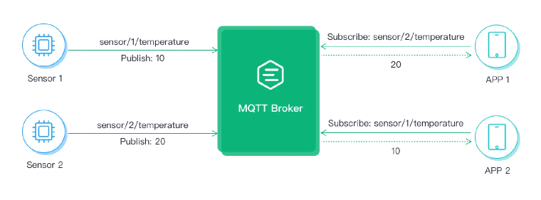

# MQTT

---
## 链接跳转

### MQTT 教程  
https://www.emqx.com/zh/mqtt-guide

### 在 ESP32 上使用 MQTT：入门指南
https://www.emqx.com/zh/blog/esp32-connects-to-the-free-public-mqtt-broker

### Python MQTT 客户端：2025 年选型指南
https://www.emqx.com/zh/blog/comparision-of-python-mqtt-client

---

MQTT（Message Queuing Telemetry Transport）

轻量级、基于**发布-订阅模式**的**消息传输协议**

由 MQTT 客户端通过主题**Topic** 发布或订阅消息，  
通过 MQTT **Broker** 集中管理消息路由，  
并依据预设的服务质量等级(QoS)确保端到端消息传递可靠性。

### MQTT Broker
- MQTT Broker 是负责**处理客户端请求**的关键组件

### 发布-订阅模式
- 将发送消息的客户端（发布者）和接收消息的客户端（订阅者）进行了**解耦**  
- 发布者和订阅者之间**无需建立直接连接**
- 通过 **MQTT Broker** 来负责消息的路由和分发

### [主题](https://www.emqx.com/zh/blog/advanced-features-of-mqtt-topics)
- MQTT 协议根据主题来**转发消息**
- 通过` / `来区分层级，类似于` URL `路径
- MQTT 主题支持以下两种通配符：`+ 单层通配符` 和 `# 多层通配符`。

  _注意：通配符主题**只能用于订阅**，不能用于发布_

---

---

---

### [QoS](https://www.emqx.com/zh/blog/introduction-to-mqtt-qos)
- MQTT 协议支持三种服务质量等级：0、1、2
- QoS 0：**消息最多传送一次。如果当前客户端不可用，它将丢失这条消息**
- QoS 1：**消息至少传送一次**
- QoS 2：**消息只传送一次**

1. 通常选择使用 **QoS 0** 传输一些高频且不那么重要的数据，比如**传感器数据**，周期性更新，即使遗漏几个周期的数据也可以接受。
2. **QoS 1** 可以保证消息到达，所以适合传输一些较为重要的数据，比如下达关键指令、更新重要的有实时性要求的状态等。
3. **QoS 2** 既可以保证消息到达，也可以保证消息不会重复，但传输成本最高。如果我们不愿意自行实现去重方案，并且能够接受 QoS 2 带来的额外开销，那么 QoS 2 将是一个合适的选择。通常我们会在金融、航空等行业场景下会更多地见到 QoS 2 的使用。

_使用QoS 1 要考虑去重_

---
## MQTT 的工作流程
1. **客户端使用 TCP/IP 协议与 Broker 建立连接**
2. **客户端既可以向特定主题发布消息，也可以订阅主题以接收消息**
3. **MQTT Broker 接收发布的消息**

---

---

- MQTT 5.0 增加了**请求响应**特性，  
- 以实现订阅者收到消息后向某个主题发送应答，发布者收到应答后再进行后续操作。

